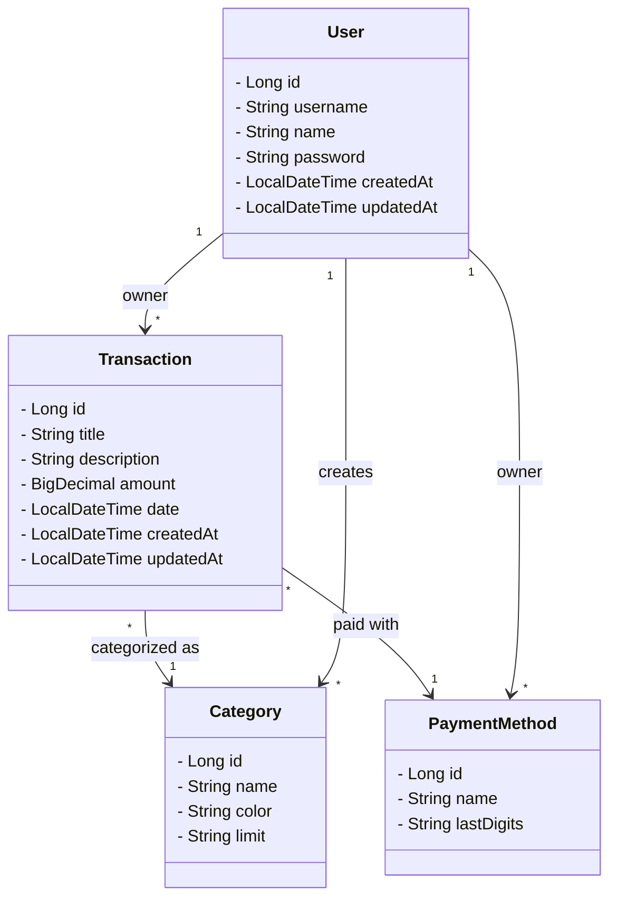

```mermaid
classDiagram
    class User {
        - Long id
        - String username
        - String name
        - String password
        - LocalDateTime createdAt
        - LocalDateTime updatedAt
    }

    class Transaction {
        - Long id
        - String title
        - String description
        - BigDecimal amount
        - LocalDateTime date
        - LocalDateTime createdAt
        - LocalDateTime updatedAt
    }

    class PaymentMethod {
        - Long id
        - String name
        - String lastDigits
    }

    class Category {
        - Long id
        - String name
        - String color
        - String limit
    }

    %% ======= RELATIONS =======

    User "1" --> "*" Transaction : owner
    Transaction "*" --> "1" Category : categorized as
    Transaction "*" --> "1" PaymentMethod : paid with
    User "1" --> "*" Category : creates
    User "1" --> "*" PaymentMethod : owner

```